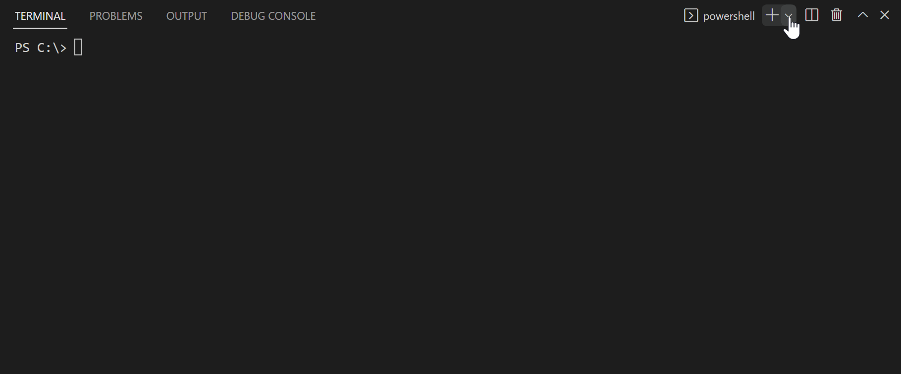

# VS Code API Explorer

This extension adds a new "VS Code API Explorer" terminal profile. Unlike a normal Node REPL, it is hosted directly in the VS Code extension host process and has access to the VS Code API through the predefined `vscode` variable. This makes it easy to experiment with the API or better understand edge cases that aren't covered in the documentation.

## Contributing

If you encounter problems or have ideas for new features, please open [open an issue](https://github.com/benmcmorran/vscode-api-explorer/issues/new).

Contributions are also welcome! To get started, clone the repo, run `npm install` and then press F5 to build and start debugging. Once your changes are ready, [open a pull request](https://github.com/benmcmorran/vscode-api-explorer/compare).

## Credits

[Icon](https://www.flaticon.com/free-icon/development-plan_4248507) made by [Smashicons](https://www.flaticon.com/authors/smashicons) from [www.flaticon.con](https://www.flaticon.com)
